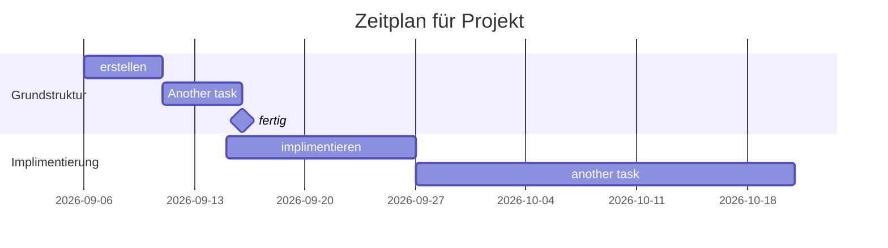

# Vorstellung
- CLI tool um bestimmte Dateien dir wichtig für Setup sind in einzelne Ordner einzuteilen und zu komprimieren
- Soll reproduciable sein
- einfach zu bedienen

# Funktionen
- Sagen welche Ordner wichtig sind für das Setup und diese in einen eigene Ordner/Vault kopieren
- Ordner im CLI tool Benennbar
- bei veränderungen an Orginal datein auch veränderung in "Vault"
- möglichkeit automatisch bash skript zu erstellen was alle Programme und dependencies installiert (soll automatisch nach Packagemanager gucken)
- in cli menü zur auswahl welches setup man haben möchte

# Zeitplan 

